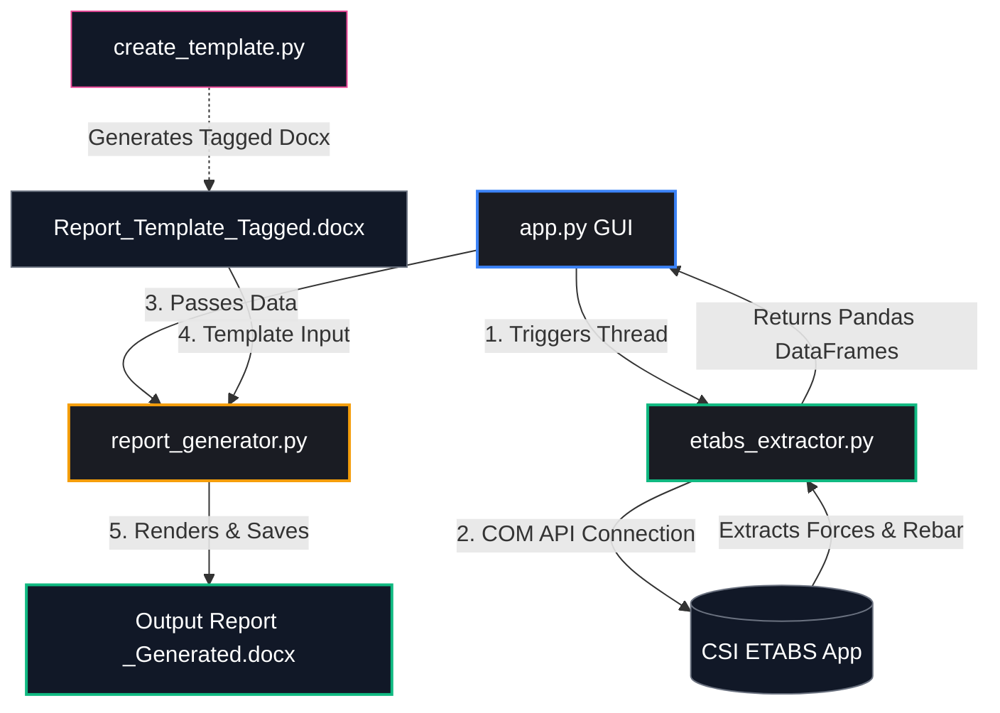

# ETABS Report Generator 📊🏗️

An automated, GUI-based tool designed to streamline and accelerate structural engineering reporting. It connects directly to **CSI ETABS** via its COM API, extracts analytical frame forces and concrete design reinforcement results, and dynamically generates professional, formatted Microsoft Word reports using a Jinja2-based templating engine.

---

## 🌟 Overview & Objectives

In structural engineering, compiling design reports is a tedious, repetitive, and error-prone task. Engineers often spend hours manually copy-pasting tables, forces, and design outcomes from ETABS into Microsoft Word documents. 

**ETABS Report Generator** solves this by:
1. **Automating Data Extraction**: Programmatically executing analysis and design in ETABS to extract exact frame forces and required reinforcement.
2. **Dynamic Templating**: Merging the extracted data directly into existing, branded Word documents (`.docx`) utilizing high-performance placeholders and table-loops.
3. **Providing a Modern Interface**: Wrapping the entire process in a clean, modern, dark-themed desktop application.
4. **Cross-Platform Testability**: Enabling development and template testing on non-Windows/non-ETABS platforms (such as macOS) through intelligent mockup/dummy data fallbacks.

---

## 🛠️ Architecture & System Workflow

The program is structured as a modular Python application. The interaction between components is illustrated below:



### Component Breakdown

*   **`app.py`**: The control center. It implements a fully responsive CustomTkinter GUI. To keep the GUI responsive and prevent the "Not Responding" freeze during heavy data extraction, it runs the extraction process in a separate background thread (`threading.Thread`).
*   **`etabs_extractor.py`**: Handles low-level COM API communication with ETABS. It connects to the running instance or starts a new one, opens the `.edb` model, runs the structural analysis, triggers the concrete design module, and extracts structural data into structured Pandas DataFrames.
*   **`report_generator.py`**: The document constructor. It reads the tagged Microsoft Word template and renders the placeholder variables and data tables using `docxtpl` (which integrates `python-docx` and Jinja2).
*   **`create_template.py`**: A helper script. It takes a master report document (e.g., `Review struktur Gedung RS Cokrodipo B. Lampung 2026.docx`) and programmatically appends Jinja-tagged placeholder variables and empty target tables with looping commands, outputting `Report_Template_Tagged.docx`.

---

## 💎 Features & Highlights

### 1. Modern Desktop Interface
Built using `customtkinter`, the application provides a modern dark-themed user interface, featuring:
*   Project metadata input fields (Project Name, Engineer Name).
*   Interactive file explorers to easily select ETABS models (`.edb`) and Word templates (`.docx`).
*   A responsive status tracker and progressive loading bar to give real-time feedback during connection, extraction, and generation phases.

### 2. Intelligent Data Extraction Pipeline
*   **Targeted Output Selection**: Deselects all load cases/combos by default and allows target selection to save massive memory and execution time.
*   **Forces Extraction**: Uses `SapModel.Results.FrameForce` to extract Axial ($P$), Shear ($V_2, V_3$), Torsion ($T$), and Bending ($M_2, M_3$) forces at every design station.
*   **Design Results Extraction**: Automatically triggers `SapModel.DesignConcrete.StartDesign()` and loops over frame objects to retrieve exact Top, Bottom, Shear, and Torsional reinforcement values using `GetSummaryResultsBeam`.

### 3. High-Fidelity Word Templating (`docxtpl`)
Instead of rewriting word files from scratch (which ruins headers, margins, and custom styles), the tool injects data directly into an existing document using standard Jinja syntax:
*   **Single Placeholders**: `{{ project_name }}` and `{{ engineer_name }}`
*   **Dynamic Word Tables**: Uses table row tags (`` ... ``) to dynamically expand and populate full tables while matching the exact fonts, borders, and alignments defined in the template.

### 4. Resilient Fallbacks (Cross-Platform)
ETABS and COM-based automation require Windows. To allow developers to work, design, and test UI/rendering updates on **macOS or Linux**, `app.py` catches library and system errors gracefully:
*   If `comtypes` is not found, or a non-Windows OS is detected, the application automatically switches to **mock/dummy data generation**.
*   This generates functional mock tables for beam forces and required rebar, allowing the `report_generator.py` workflow to be tested fully on any platform.

---

## 📝 Word Template Schema & Tagging

If you are customizing the Word template manually, or using `create_template.py`, here is the schema of tags available in the template:

| Tag Category | Variable Name | Data Type | Description |
| :--- | :--- | :--- | :--- |
| **Header Info** | `{{ project_name }}` | String | Name of the construction project |
| **Header Info** | `{{ engineer_name }}` | String | Name of the analyzing structural engineer |
| **Beam Forces Table** | `forces_list` | List of Dicts | Table containing structural forces per station |
| **Rebar Table** | `rebar_list` | List of Dicts | Table containing required concrete design reinforcement |

### Table Columns Mapping

For the dynamic table structures, use the following keys in your Jinja loops:

#### Beam Forces Table (`forces_list`)
```jinja

Frame:    {{ item.Frame }}      Station: {{ item.Station }}    LoadCase: {{ item.LoadCase }}
P:        {{ item.P }}          V2:      {{ item.V2 }}         V3:       {{ item.V3 }}
T:        {{ item.T }}          M2:      {{ item.M2 }}         M3:       {{ item.M3 }}

```

#### Reinforcement Table (`rebar_list`)
```jinja

Frame:      {{ item.Frame }}      Station:  {{ item.Station }}
Top Rebar:  {{ item.TopRebar }}   Bot Rebar: {{ item.BotRebar }}
Shear Rebar:{{ item.ShearRebar }} Torsion:  {{ item.TorsionRebar }}

```

---

## 🚀 Installation & Getting Started

### Prerequisites
*   Python 3.8 or higher.
*   (For live ETABS extraction) Microsoft Windows and CSI ETABS installed.

### Setup Instructions

1.  **Clone / Open the Workspace**:
    Make sure you are in the project folder:
    ```bash
    cd "ETABS Report Generator"
    ```

2.  **Activate Virtual Environment**:
    *   **Windows**:
        ```bash
        venv\Scripts\activate
        ```
    *   **macOS / Linux**:
        ```bash
        source venv/bin/activate
        ```

3.  **Install Dependencies**:
    ```bash
    pip install customtkinter pandas comtypes docxtpl python-docx
    ```

---

## 📖 How to Run & Generate Reports

### Step 1: Pre-tag Your Document (Optional)
If you have a base report and want to add the dynamic tables automatically:
```bash
python create_template.py
```
This takes `Review struktur Gedung RS Cokrodipo B. Lampung 2026.docx` and generates `Report_Template_Tagged.docx` ready to use.

### Step 2: Launch the GUI App
```bash
python app.py
```

### Step 3: Generate the Report
1.  Enter your **Project Name** and **Engineer Name**.
2.  Browse and select your ETABS Model file (`.edb`).
3.  Browse and select your Tagged Word Template (`Report_Template_Tagged.docx`).
4.  Click **Generate Report**.
    *   *On Windows with ETABS*: The tool will launch ETABS, extract analytical results, format them, and output a new Word document.
    *   *On macOS / Development*: The tool will alert you and generate a functional document using dummy data so you can check styling and layouts.
5.  Find your completed document saved adjacent to your template, appended with `_Generated.docx`.
